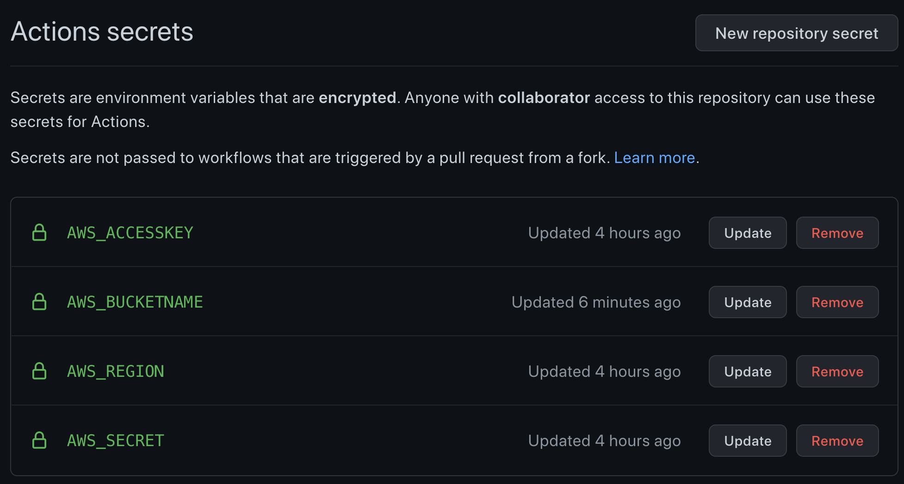

<!--
<div align="center">
  <a href="https://github.com/praparn/github-action-cloud-environment">
    
  </a>
-->
<h3 align="left">GitHub Action for Cloud Provider</h3>
  <p align="left">
     This repository is backgroud to leverage feature of github action and terraform technology for manage in lifecycle of cloud provider element from scratch to enterprise architecture. And will continute update
   </p>
</div>

### Remark

* All credential in this project was designed to store on "secrets" on github. If you new with this. Please kindly following [GitHub Secrets](https://github.com/Azure/actions-workflow-samples/blob/master/assets/create-secrets-for-GitHub-workflows.md)
* As project are coverage multiple cloud provider. So when you fork/clone this repository in action. You can consider to remove unused cloud provider's folder


### Built With

* [Azure Cli](https://docs.microsoft.com/en-us/cli/azure/)
* [AWS Cli](https://aws.amazon.com/th/cli/)
* [Gcloud Cli](https://cloud.google.com/sdk/gcloud)
* [Terraform](https://www.terraform.io/)
* [GitHub Action](https://github.com/features/actions)

<p align="right">(<a href="#top">back to top</a>)</p>

### File type descrition
* *******************template (File template for factory reset state. Don't touch this file)
* xxxx.sh: Shell file for operate terraform manual on local machine. Incase you need to run terraform by yourself
* xxxx.tf: File terraform script for operate
* global_variable.auto.tfvars: Global configuration file for setup on AWS environment. This file should be one-time setup
* global_variables.tf: Global variable file description. Please read all global configuration description on this file. But never modified it 
* system_variable.auto.tfvars: System generate configuration file when create "1.Environment". So never edit this file by yourself
* system_variables.tf: System variable file description. So you can view about system configruation description ont his file. But never modified it
* terraform.tfvars: (Local configuration file) on each folder. This file will housing configuration of each compoenent on specific folder. Please check and edit configruation as required on this file
* variables.tf: (Local variable file description) Please read this file for check detail of all description that you need to configure. But never modified it
<!-- GETTING STARTED -->


## AWS Cloud Provider
<br>

AWS Cloud Provider: Automation to create all environment on AWS cloud

* VPC: Virtual Private Cloud
* IG: Internet Gateway
* NG: Nat Gateway
* Subnet: Subnet on Private (3 AZ) and Public (3 AZ)
* DNS: Route53 dns for internal use
* Route Table: Public Route/Private Route
* VPN Gateway: Create VPN gateway for establish VGWs
* Instance: Instance EC2
* Database: Database all type support
* Bucket: Simple Storage Service
* Queue: Message Queue
* Other: 


### DirectoryStructure
* 99.Systemplate (Housing global configuration that use for all element in terraform)

* Software: Housing AWS VPN Client

* 1.Environment 
  * 01_BaseEnvironment (VPC, Subnet, Internet GW, NAT GW, Route Table etc)
  * 02_InitialParameter (IAM Role, Key Pair for EC2)

* 2.Instance
  * 01_Standard_Linux (Template basic linux instance)
  * 01_Standard_Linux_Public (Template basic linux instance with accessable from public ip)
  * 02_MultipleAZ_Linux (template multiple linux instance in multi avaliability zone)
  * 02_MultipleAZ_Linux_Public (template multiple linux instance in multi avaliability zone with accessable from public ip)
  * 03_Docker_Linux (Template Docker pre-install (ubuntu base))
  * 03_Docker_Linux_Public (Template Docker pre-install (ubuntu base) with accessable from public ip)
  * 04_MultipleAZ_Kubernetes (Template Kubernetes native pre-install (ubuntu base))
  * 04_MultipleAZ_Kubernetes_Public (Template Kubernetes native pre-install (ubuntu base) with accessable from public ip)
  * 05_SingleAZ_Windows (Template Basic Windows Instance)
  * 05_SingleAZ_Windows (Template Basic Windows Instance) with accessable from public ip

* 3.Database
  * 01_AuroraCluster_Database (Template Aurora cluster)
  * 02_GenericRDS_Database (Template all kind of RDBMS database (Mysql, MariaDB, Postgresql, MSSQL etc.))
  * 03_DocumentDBCluster_Database (Template for Mongo database compatible with DocumentDB cluster)

* 4.Cache
  * 01_Cache (Template for Redis/Memcache Cache)
  
* 5.Bucket
  * 01_S3 (Template Bucket+IAM)

* 6.Message Queue
  * 01_RabbitMQ (Template RabbitMQ)
  * 01_RabbitMQ_Cluster (Template RabbitMQ cluster)
  * 02_ActiveMQ (Template ActiveMQ)
  * 02_ActiveMQ_StandbyCluster (Template ActiveMQ cluster)


### Trigger on GitHub Action

* Initial Environment: For create S3 bucket for housing all "state" file/check public key to operate
  * Tag: aws-init-env-xxxxxxx
  * Commit: <any thing>

* Initial Foundation: For create basic element (VPC, subnet, routing, policy etc) (1.Environment/01_BaseEnvironment-02_InitialParameter)
  * Tag: aws-init-foundation-xxxxxxx
  * Commit: <any thing>

* Create Elements: For create <element> (instance/database/cache/bucket/queue/other) *Remark: you must to copy template to create new folder before operate
  * Tag: aws-create-<element>-xxxxxxx
  * Commit: <folder name>-<your message>

* Modify Elements: For modify <element> (instance/database/cache/bucket/queue/other)
  * Tag: aws-modify-<element>-xxxxxxx
  * Commit: <folder name>-<your message>

* Destroy Elements: For destroy <element> (instance/database/cache/bucket/queue/other)
  * Tag: aws-destroy-<element>-xxxxxxx
  * Commit:<folder name>-<your message>

* Destroy Foundation: For destroy basic element (VPC, subnet, routing, policy etc)
  * Tag: aws-destroy-foundation-xxxxxxx
  * Commit: <any thing>

* Destroy Environment: For destroy S3 bucket for housing all "state" file
  * Tag: aws-destroy-env-xxxxxxx
  * Commit: <any thing>


### Prerequisites

1. Create IAM account (Non root) with privilege "administrator" by following [AWS's best practice](https://docs.aws.amazon.com/IAM/latest/UserGuide/best-practices.html) 

2. Input credential for operate on github's "secrets" as detail below:
  - {AWS_ACCESSKEY}: Store access key. Please follow this KB [AWS access key](https://aws.amazon.com/th/premiumsupport/knowledge-center/create-access-key/)
  ```sh
  {
    <AWS Access Key>
  }
  ```
  - {AWS_SECRET}: Store secret key. Please follow this KB [AWS secret key](https://aws.amazon.com/th/premiumsupport/knowledge-center/create-access-key/)
  ```sh
  {
    <AWS Secret Key>
  }
  ```
  - {AWS_REGION}: Regional for housing AWS environment.
  ```sh
  {
    <AWS Region>
  }
  ```
  - {AWS_BUCKETNAME}: AWS bucket name for housing "statefile". This name need very unique in region of AWS. Ex "<organizationname>-<projectname>-<yyyymmdd>".
  ```sh
  {
    <AWS Bucket Name>
  }
  ```
<br>


### Initial Environment and Foundation (work directory: ./aws)

1. Clone the repo
   ```sh
   git clone https://github.com/praparn/github-action-any-cloud-env.git
   ```

2. Create key-pair for use with environment and copy file "cert-template.pub" to path "1.Environment/02_InitialParameter"
   ```sh
   ssh-keygen -t rsa -N '' -f ~/cert-template 
   ```

3. Copy public key (cert-template.pub) to path "1.Environment/02_InitialParameter"
   ```sh
   cp ~/cert-template.pub ./github-action-any-cloud-env/aws/1.Environment/02_InitialParameter
   ```

4. Initial AWS environment by commit and tag "aws-init-env*" (This create S3 bucket for housing terraform state file)
   ```sh
   git pull
   git tag #check existing tag
   echo "aws-init-env-yyyymmddhhmmss" > ./result/result-aws
   git add -A
   git commit -m "Any comment that you need"
   git tag aws-init-env-yyyymmddhhmmss -m "aws-init-env-yyyymmddhhmmss"
   git push --atomic origin <branch name> aws-init-env-yyyymmddhhmmss
   ```

5. Check progress on tab "action" until it finished. (Optional: Verify result on web console/cli for double check)<br><br>

6. Edit properties for create AWS foundation on file "99.Systemplate/global_variable.auto.tfvars" (Please check description on file "99.Systemplate/global_variables.tf")
   ```sh
   vi global_variable.auto.tfvars
   ```

7. Initial AWS foundation by commit and tag "aws-init-foundation*"
   ```sh
   git pull
   git tag #check existing tag
   echo "aws-init-env-yyyymmddhhmmss" > ./result/result-aws
   git add -A
   git commit -m "Any comment that you need"
   git tag aws-init-env-yyyymmddhhmmss -m "aws-init-env-yyyymmddhhmmss"
   git push --atomic origin <branch name> aws-init-env-yyyymmddhhmmss
   ```

8. Check progress on tab "action" until it finished. (Optional: Verify result on web console/cli for double check)<br>


### Create Element (2.Instance/3.Database/4.Cache/5.Bucket/6.Queue/7.Other)

1. Select template of element from sub folder under <element> and create new folder name
   ```sh
   cp <element>/<template folder> <element folder>/<folder name>  
   ```

2. Edit properties for create element on file "terraform.tfvars" (Please check description on file "variables.tf")
   ```sh
   vi <element>/<folder name>/terraform.tfvars
   ```

3. Apply the change to create element by commit with message "<folder name>" and tag "aks-create-<element>-*"
   ```sh
   git pull
   git tag #check tag duplicate
   echo "aws-create-<element>-yyyymmddhhmmss" > ./result/result-aws
   git add -A
   git commit -m "<folder name>-<your message>"
   git tag aws-create-<element>-yyyymmddhhmmss -m "aws-create-<element>-yyyymmddhhmmss"
   git push --atomic origin <branch name> aws-create-<element>-yyyymmddhhmmss
   ```

4. Check progress on tab "action" until it finished. (Optional: Verify result on web console/cli for double check)<br>


### Modify Element (2.Instance/3.Database/4.Cache/5.Bucket/6.Queue/7.Other)

1. Select template of element to modify under <element>
   ```sh
   cd <element folder>/<folder name>  
   ```

2. Edit properties for modify element on file "terraform.tfvars" (Please check description on file "variables.tf")
   ```sh
   vi <element>/<folder name>/terraform.tfvars
   ```

3. Apply the change to modify element by commit with message "<folder name>" and tag "aks-modify-<element>-*"
   ```sh
   git pull
   git tag #check tag duplicate
   echo "aws-modify-<element>-yyyymmddhhmmss" > ./result/result-aws
   git add -A
   git commit -m "<folder name>-<your message>"
   git tag aws-modify-<element>-yyyymmddhhmmss -m "aws-modify-<element>-yyyymmddhhmmss"
   git push --atomic origin <branch name> aws-modify-<element>-yyyymmddhhmmss
   ```

4. Check progress on tab "action" until it finished. (Optional: Verify result on web console/cli for double check)<br>


### Destroy Element (2.Instance/3.Database/4.Cache/5.Bucket/6.Queue/7.Other)

1. Select template of element to destroy under <element>
   ```sh
   cd <element folder>/<folder name>  
   ```

2. Apply the change to destroy element by commit with message "<folder name>" and tag "aks-destroy-<element>-*"
   ```sh
   git pull
   git tag #check tag duplicate
   echo "aws-destroy-<element>-yyyymmddhhmmss" > ./result/result-aws
   git add -A
   git commit -m "<folder name>-<your message>"
   git tag aws-destroy-<element>-yyyymmddhhmmss -m "aws-destroy-<element>-yyyymmddhhmmss"
   git push --atomic origin <branch name> aws-destroy-<element>-yyyymmddhhmmss
   ```

3. Check progress on tab "action" until it finished. (Optional: Verify result on web console/cli for double check)<br>


### Destroy Environment and Foundation (work directory: ./aws) !!! Warning: This process is not recommend unless you never need to use the environment anymore !!!

1. Destroy AWS foundation by commit and tag "aws-destroy-foundation*"
   ```sh
   git pull
   git tag #check existing tag
   echo "aws-destroy-foundation-yyyymmddhhmmss" > ./result/result-aws
   git add -A
   git commit -m "Any comment that you need"
   git tag aws-destroy-foundation-yyyymmddhhmmss -m "aws-destroy-foundation-yyyymmddhhmmss"
   git push --atomic origin <branch name> aws-destroy-foundation-yyyymmddhhmmss
   ```

2. Check progress on tab "action" until it finished. (Optional: Verify result on web console/cli for double check)<br>

3. Destory AWS environment by commit and tag "aws-destroy-env*" (This delete S3 bucket for housing terraform state file and rollback all element to default)
   ```sh
   git pull
   git tag #check existing tag
   echo "aws-destroy-env-yyyymmddhhmmss" > ./result/result-aws
   git add -A
   git commit -m "Any comment that you need"
   git tag aws-destroy-env-yyyymmddhhmmss -m "aws-destroy-env-yyyymmddhhmmss"
   git push --atomic origin <branch name> aws-destroy-env-yyyymmddhhmmss
   ```

4. Check progress on tab "action" until it finished. (Optional: Verify result on web console/cli for double check)<br>

<p align="right">(<a href="#top">back to top</a>)</p>


## Azure Cloud Provider

Azure Cloud Provider: Automation to create all environment on Azure cloud
<To Be Continute>


<!-- LICENSE -->
## License

Distributed under the Apacher License. See `LICENSE.txt` for more information.

<p align="right">(<a href="#top">back to top</a>)</p>


<!-- CONTACT -->
## Contact

Praparn Lueangphoonlap - [@facebook](https://www.facebook.com/praparn.lungpoonlap) - eva10409@gmail.com

Project Link: [https://github.com/praparn/github-action-any-cloud-env](https://github.com/praparn/github-action-any-cloud-env)

<p align="right">(<a href="#top">back to top</a>)</p>


<!-- Utility Command -->
## Utility Command

1. Git reset and pull everything from remote/main
   ```sh
   git fetch origin
   git reset --hard origin/main
   ```
2. Git reset tag (Delete all tags local/remote)
   ```sh
   git tag -l | xargs git tag -d
   git fetch --tags
   git push origin --delete $(git tag -l) 
   git tag -d $(git tag -l)
   ```
<p align="right">(<a href="#top">back to top</a>)</p>


<!-- MARKDOWN LINKS & IMAGES -->
<!-- https://www.markdownguide.org/basic-syntax/#reference-style-links -->
[contributors-shield]: https://img.shields.io/github/contributors/github_username/repo_name.svg?style=for-the-badge
[contributors-url]: https://github.com/github_username/repo_name/graphs/contributors
[forks-shield]: https://img.shields.io/github/forks/github_username/repo_name.svg?style=for-the-badge
[forks-url]: https://github.com/github_username/repo_name/network/members
[stars-shield]: https://img.shields.io/github/stars/github_username/repo_name.svg?style=for-the-badge
[stars-url]: https://github.com/github_username/repo_name/stargazers
[issues-shield]: https://img.shields.io/github/issues/github_username/repo_name.svg?style=for-the-badge
[issues-url]: https://github.com/github_username/repo_name/issues
[license-shield]: https://img.shields.io/github/license/github_username/repo_name.svg?style=for-the-badge
[license-url]: https://github.com/github_username/repo_name/blob/master/LICENSE.txt
[linkedin-shield]: https://img.shields.io/badge/-LinkedIn-black.svg?style=for-the-badge&logo=linkedin&colorB=555
[linkedin-url]: https://linkedin.com/in/linkedin_username
[product-screenshot]: images/screenshot.png
